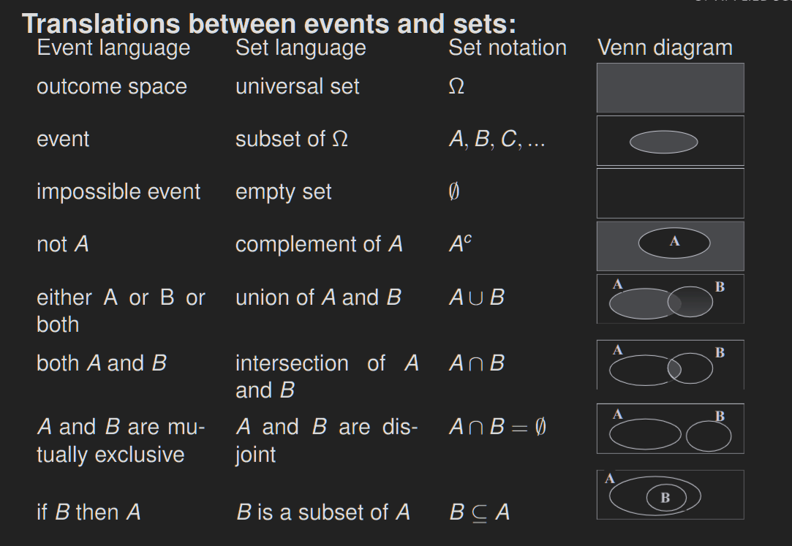

# Probability Spaces

# Basic Rules

$A, B$ = Events; $P(x)$ = Propability of Event x

------------------------------------------------------------------------

+--------------------+-----------------------------+----------------------------------------+
| $P(A^c)$           | $1-P(A)$                    | Probability that \$A\$ did not happen  |
+--------------------+-----------------------------+----------------------------------------+
| $P(\emptyset)$     | $0$                         | Probability of a null Event            |
+--------------------+-----------------------------+----------------------------------------+
| $P(A \cap B)$      | $P(A) * P(B)$               | Probability of A and B occurring       |
|                    |                             |                                        |
|                    | $P(A|B)*P(B)$               |                                        |
+--------------------+-----------------------------+----------------------------------------+
| $P(A \setminus B)$ | $P(A) - P(A \cap B)$        | Probability of A without B             |
+--------------------+-----------------------------+----------------------------------------+
| $P(A \cup B)$      | $P(A) + P(B) - P(A \cap B)$ | Probability of A or B occurring        |
+--------------------+-----------------------------+----------------------------------------+
| $P(A|B)$           | $\frac{P(A \cap B)}{P(B)}$  | Probability of A if B already happened |
+--------------------+-----------------------------+----------------------------------------+

$A \subseteq B \implies P(A) \leq P(B)$
